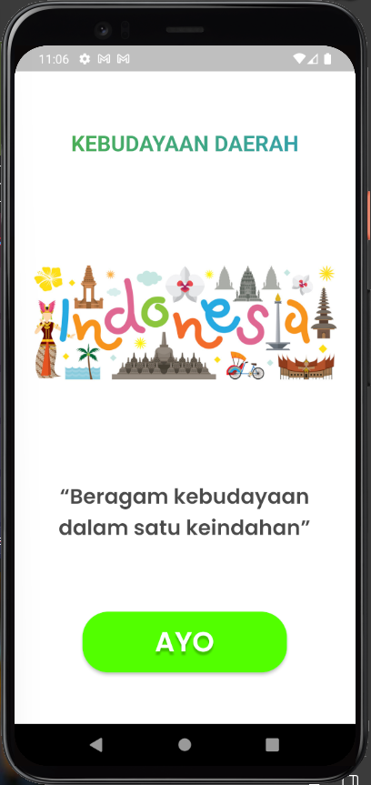
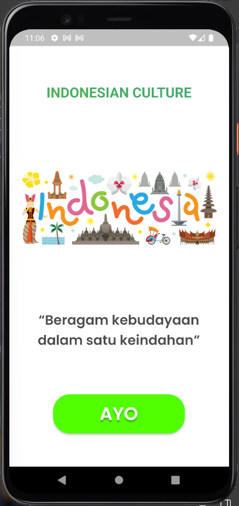
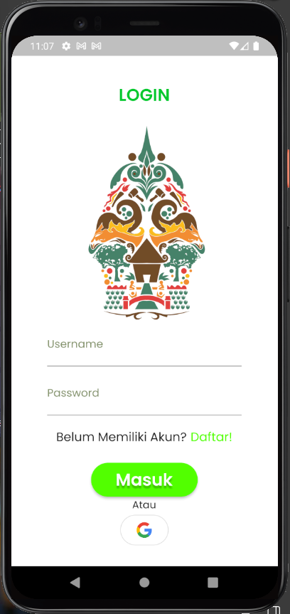
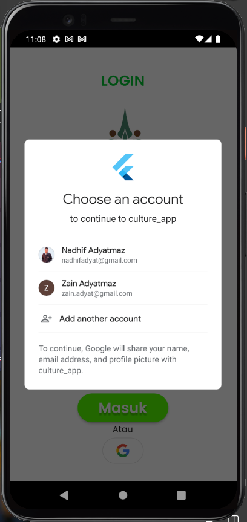
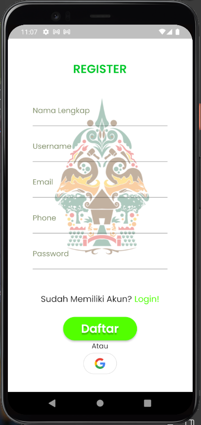
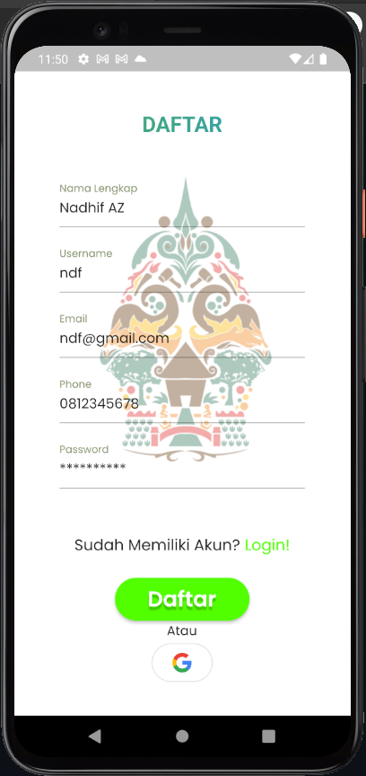
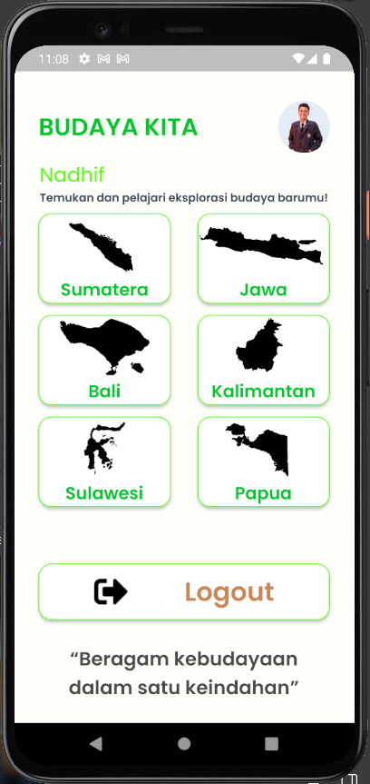
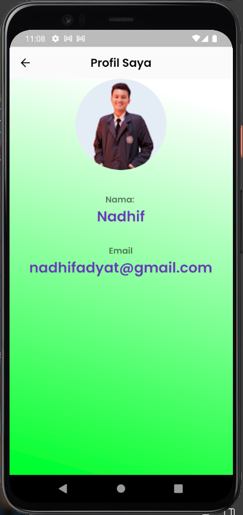
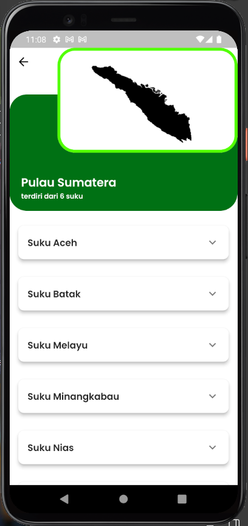
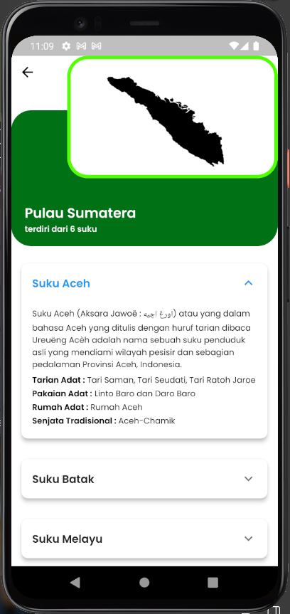

# PROJECT-MOBILE-2023
# CULTURE-APP

## Nama : Nadhif Adyatma Zain
## NIM : 2131750003

## - - - - - - - - - - - - - - - - - -
### Deskripsi : Aplikasi yang membantu mengenal lebih jauh tentang berbagai macam kebudayaan daerah yang ada di Indonesia, kebudayaan ini meliputi keanekaragaman suku adat, tarian adat, pakaian adat, rumah adat, lagu daerah, budaya, dan bahasa.
## - - - - - - - - - - - - - - - - - -

## 1. Halaman Getting_start

  

Penjelasan :
1. Terdapat Layout yang menggunakan Stateless Widget dengan tampilan yang membagi 4 baris pada 1 kolom.
2. Terdapat Text Animation pada teks "KEBUDAYAAN DAERAH - INDONESIAN CULTURE" pada baris pertama.
3. Terdapat Image widget pada baris kedua.
4. Terdapat Text "Beragam kebudayaan dalam satu keindahan" pada baris ketiga.
5. Terdapat Navigasi Text Button "AYO" pada baris keempat yang melakukan perpindahan ke halaman login

## 2. Halaman Login

  

Penjelasan :
1. Terdapat Layout yang menggunakan Statefull Widget dengan tampilan yang membagi 3 baris pada 1 kolom.
2. Terdapat Text Animation pada teks "LOGIN - MASUK" pada baris pertama.
3. Terdapat Image widget dan FieldInput "Username dan Password" pada baris kedua.
4. Terdapat baris yang berisi Text "Belum Memiliki Akun?" dan Text "Daftar" yang dapat berpindah ke halaman register pada baris ketiga.
5. Terdapat Navigasi Text Button "Masuk" yang melakukan perpindahan ke halaman utama.
6. Terdapat Button logo Google untuk melakukan login menggunakan firebase

## 3. Halaman Register

  

Penjelasan :
1. Terdapat Layout yang menggunakan Statefull Widget dengan tampilan yang membagi 3 baris pada 1 kolom.
2. Terdapat Text Animation pada teks "REGISTER - DAFTAR" pada baris pertama.
3. Terdapat Image widget dan FieldInput "Nama Lengkap, Username, Email, Phone, dan Password" menggunakan Map/List data pada baris kedua.
4. Terdapat baris yang berisi Text "Sudah Memiliki Akun?" dan Text "Login!" yang dapat berpindah ke halaman Login pada baris ketiga.
5. Terdapat Navigasi Text Button "Daftar" yang melakukan perpindahan ke halaman utama.
6. Terdapat Button logo Google untuk melakukan login menggunakan firebase

## 4. Halaman Utama (Dashboard)

Penjelasan :
1. Terdapat Layout yang menggunakan Statefull Widget dengan tampilan yang membagi 4 baris pada 1 kolom.
2. Terdapat TextWidget pada teks "BUDAYA KITA" dan Avatar Image yang apabila di klik berpindah ke halaman Profil.
3. Terdapat TextWidget pada teks "Nadhif" dan TextWidget pada teks "Temukan dan pelajari eksplorasi budaya barumu" pada baris kedua.
4. Terdapat ImagesWidget dengan struktur 2 kolom 3 baris yang berisi Logo dan nama pulau yang menggunakan navigasi berpindah ke halaman Screen pada baris ketiga.
5. Terdapat Navigasi Text Button "Logout" yang berintegrasi untuk mengakhiri login menggunakan firebase dan melakukan perpindahan ke halaman Login.
6. Terdapat Text "Beragam kebudayaan dalam satu keindahan" pada baris ketiga.

## 5. Halaman Profil

Penjelasan :
1. Terdapat Layout yang menggunakan Statefull Widget dengan tampilan background gradiasi warna hijau dan putih.
2. Terdapat Appbar yang berisi Text "Profil Saya".
3. Terdapat Avatar Image dan TextWidget pada teks nama "Nadhif" dan TextWidget pada teks email "nadhifadyat@gmail.com".

## 6. Halaman Detail

  

Penjelasan :
1. Terdapat Layout yang menggunakan Statefull Widget dengan tampilan yang membagi 2 baris pada 1 kolom.
2. Terdapat TextWidget pada teks "Pulau Sumatera" dan "terdiri dari 6 suku" dengan background warna hijau tua dan logo pulau dengan background putih garis border hijau muda.
3. Terdapat Listview builder dengan tampilan card pada masing-masing suku yang dapat di expand untuk menampilkan data yang diambil dari data assets .json.